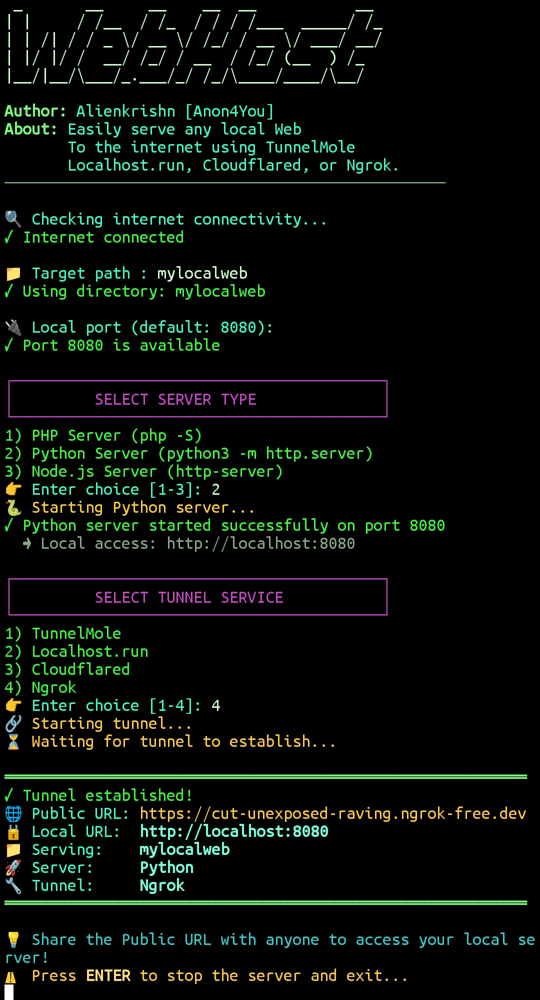

<div align="center">


**Easily serve any local web project to the internet — instantly.**

[](#-installation)
[](#-features)
[](#-features)

<br>

<details>
<summary><b>📸 Click to view screenshot</b></summary>
<br>

</details>

<br>

</div>

---

## 📦 Installation

```bash
curl -sL https://github.com/Anon4You/WebHost/raw/main/install.sh | bash
```

---

## 🚀 Usage

WebHost is a fully interactive tool. No arguments or config files needed—just run it:

```bash
webhost
```

1. **Select Server Type** — Choose between PHP, Python, or Node.js.
2. **Select Tunnel Service** — Pick your preferred tunnel (Ngrok, Cloudflared, Localhost.run, or TunnelMole).
3. **Go Live** — WebHost starts the server and gives you a clean, public URL.

---

## ✨ Features

* **🔀 Multiple Hosting Options** — Switch between Ngrok, Cloudflared, Localhost.run, and TunnelMole on the fly.
* **🔗 No Link Issues** — Generates clean, working, and directly shareable public URLs.
* **⚙️ Multi-Runtime Support** — Easily spin up servers for PHP, Python, and Node.js projects.

---

<div align="center">

**Author: Alienkrishn [Anon4You]**

</div>
